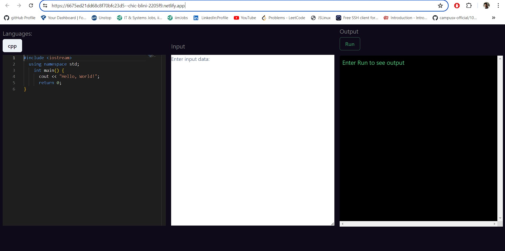

                          
 

 
# ONLINE CODE EDITOR

[](https://img.shields.io/github/v/release/navendu-pottekkat/awesome-readme?include_prereleases)
[](https://img.shields.io/github/last-commit/navendu-pottekkat/awesome-readme)
[](https://img.shields.io/github/issues-raw/navendu-pottekkat/awesome-readme)
[](https://img.shields.io/github/issues-pr/navendu-pottekkat/awesome-readme)
[](https://img.shields.io/github/license/navendu-pottekkat/awesome-readme)

<p>
Introducing our Online Compiler, a powerful and intuitive web application designed to streamline the coding experience for developers of all levels. Built using the robust frameworks of React and Node.js, this online compiler offers a seamless and efficient environment for writing, running, and testing code in multiple programming languages. Whether you are a beginner learning to code or an experienced developer working on a project, our compiler provides all the tools you need to code efficiently.
</p>

<h3>Features</h3> 
<b>Multi-Language Support:</b>  

Write and execute code in various programming languages including Python,  Java, C++.
Switch effortlessly between languages with a user-friendly interface.

<b> Real-time Code Execution:</b>

Instant feedback with real-time code execution.
View output and debug information immediately after running your code.

<b>Intuitive User Interface:</b>

Clean and modern design using React for a smooth user experience.
Code editor with syntax highlighting, auto-completion, and error detection.

<b>Backend Efficiency:</b>

Powerful backend services built with Node.js for fast and reliable code compilation and execution.
Scalable architecture to handle multiple concurrent users without compromising performance.
<b>Customization and Themes:</b>

Customize the editor’s appearance with various themes and settings.
Tailor the coding environment to suit your preferences for maximum productivity.

<b>Integrated Debugger:</b>

Step through your code with the integrated debugger.
Identify and fix errors quickly with comprehensive debugging tools.

<!-- Add badges with link to Shields IO -->


: Shows the current release version.


: Shows the last commit time. Good indication of the project activity.


: Dynamic badge that shows the number of open issues in the project.


: Similar dynamic badge, but for pull requests.

 
# Installation
[(Back to top)](#table-of-contents)

> **Note**: For longer README files, I usually add a "Back to top" buttton as shown above. It makes it easy to navigate.

This is where your installation instructions go.

You can add snippets here that your readers can copy-paste with click:

```shell
git clone https://github.com/rajdeep0309/EasyOnlineCompiler.git
cd REC
npm run start
```

 
# Usage
[(Back to top)](#table-of-contents)

Firstly you have to download our project after that you have to just write your code in our online code editor and click on run button to compile your code 


 
# Contribute
[(Back to top)](#table-of-contents)

RAJDEEP GHOSH AND SHOAL KOLEY Contribute to this project!


